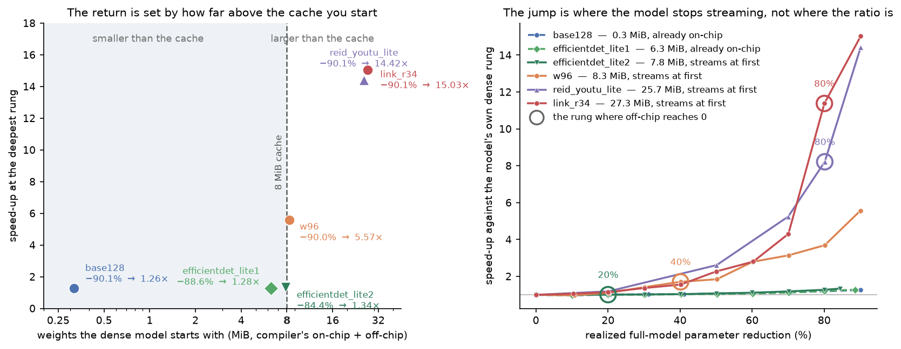
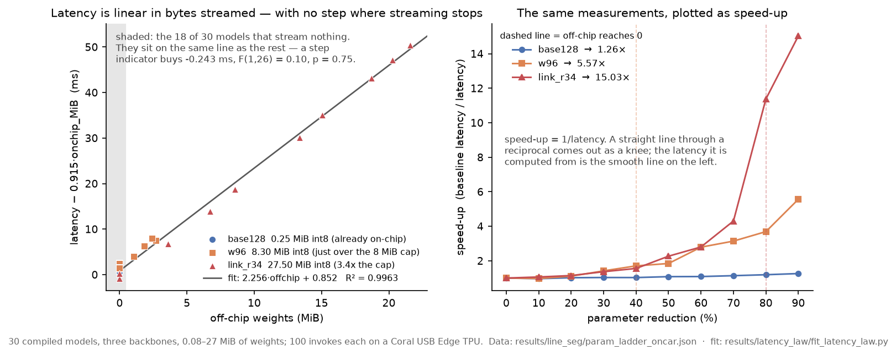
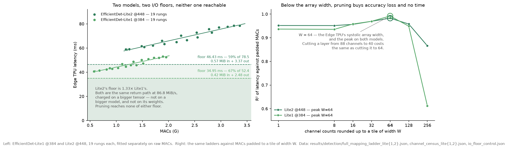
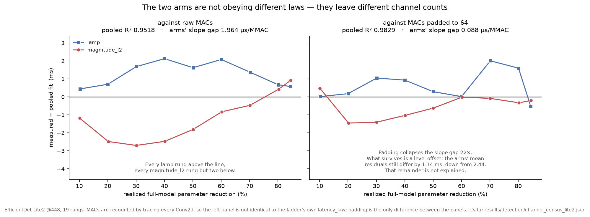
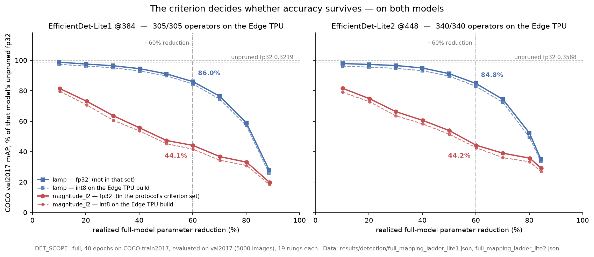
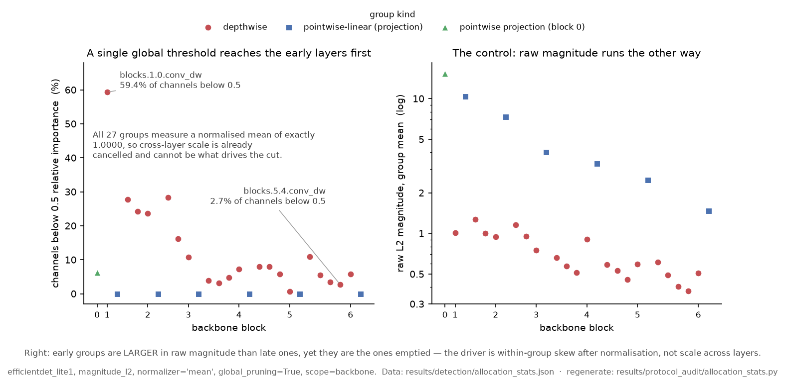

# int8-pruning-pipeline

**English** | [简体中文](README.zh-CN.md)

[](https://github.com/jiaheguo521/int8-pruning-pipeline/actions/workflows/checks.yml)
[](LICENSE)
[](pyproject.toml)
[](https://huggingface.co/jiaheguo521/int8-pruning-pipeline-models)

This repository is a PyTorch edge-deployment pipeline: an FP32 model in; structured
pruning, accuracy recovery and export; an INT8 TFLite model out, optionally compiled for
the Edge TPU, or an FP32 ONNX graph.


Reusing this pipeline has a measured cost. The pipeline-side code a new model needs comes
in two tiers: a model that brings its own data and evaluation convention and fits an
existing family needs one more declaration in `family.yaml`, about 21 to 30 lines; a model
that needs a family of its own adds 54 to 169 lines, median 94, counted across the seven
families already in the repository. The convention is stated under
[Bringing your own model](#bringing-your-own-model).

One of the seven families already here is classification; the rest are detection,
segmentation, Re-ID and open-vocabulary. A model whose structure is far from what one of
the tools in the pipeline above requires (their own repositories state those requirements)
can be distilled into a CNN student first, as in
[`jiaheguo521/relu-clip`](https://github.com/jiaheguo521/relu-clip).

Structured pruning is [`torch_pruning`](https://github.com/VainF/Torch-Pruning).
Recovery takes one of two routes, fine-tuning on the dataset's own labels or distilling
against the unpruned network frozen as its own teacher.
The default int8 export path uses `litert-torch` and `ai-edge-quantizer`, with
`torch.onnx.export` → `onnx2tf` selectable instead. A third export path quantizes nothing
and writes an fp32 ONNX graph.

The unit of work is a **rung**: one model cut to one target parameter reduction, then
recovered. There are **121** of them here across **7** families, and **154** int8 graphs
whose bytes have been audited. Where a cell of that grid was never run,
[`criterion_census.json`](results/criterion_census.json) records that it was not, rather
than leaving the grid looking filled in. On the optional Edge TPU backend, **89** models
have been timed on a Coral USB Accelerator, **131** compiled artifacts in all. A model
converted through both export paths counts as two artifacts and a re-measurement of one
artifact as one; the three synthetic I/O controls are in that total but not among the
models. Counts from [`criterion_census.json`](results/criterion_census.json),
[`tflite_size_audit.json`](results/tflite_size_audit.json),
[`full_scope_grid.json`](results/detection/full_scope_grid.json) and
[`edgetpu_census.json`](results/edgetpu_census.json).



*The headline result. Six models, three families, each cut to the same ~90% of its own
parameters, and twelve times apart in payoff, because what pruning buys on this device is
*not having to stream weights from the host*. The one that already fitted in the Edge TPU's
8 MiB parameter cache had no such cost to remove and came out **1.26× faster**; the one that
started 3.4× over it deleted 21.6 MiB of streaming and came out **15.03× faster**. The rings on the right
mark the rung where each one stops streaming (20%, 40%, 80%, 80%), and each curve turns
there. All six end with nothing left to stream. **On this device that, and not the parameter
count, is what pruning is buying.**
[Finding 2](#main-findings) below.*

## What this is

The stages of the figure above, in order.

Recovery is where the compute is. Pruning itself is data-free, since every importance
criterion here is computed from the weights and no forward pass is needed before
`pruner.step()`, so the ladder's cost is entirely in what follows it. Where labels exist the worker fine-tunes on
them; where they do not (`clip_rn50`, `reid`, `relu_clip`) it distils against a frozen
`copy.deepcopy` taken **before** pruning, so the teacher is the unpruned network itself, not a
larger one. Three of the seven families recover that way, and none of the three needs an
annotation: the two CLIP towers distil on unlabeled ImageNet, Re-ID on unlabeled Market-1501
crops. What that buys is the absence of labels, not a saving in compute. The teacher's
forward pass makes a distillation step **1.31×** a labelled one on the dense model
and **2.63×** at 90% pruned, because the teacher does not shrink when the student does
([`distill_vs_labelled_cost.json`](results/protocol_audit/distill_vs_labelled_cost.json)). Which arm a family uses is a property of that family, not a knob. Every family
declares that route, alongside the pruning modes its worker implements, and
`python -m int8_pruning.manifest capabilities` prints the table. By default each rung is
pruned from the dense baseline independently; `PRUNE_MODE=iterative` instead walks one
trajectory, feeding each recovered model back into the next round of pruning. No ladder
under [`results/`](results/) was produced that way, and that is counted rather than
asserted: **0 of the 121 rungs**, from the mode label each worker writes
([`criterion_census.json`](results/criterion_census.json)). The mechanism is tested, its
effect on retained accuracy is not measured here. Asking for the mode on a family that has not
implemented it stops the run and says so, rather than quietly falling back to the default.

Quantization is per channel by default. Three export paths leave the recovered model, two
of them reaching int8.
`litert-torch` → `ai-edge-quantizer` is the default and the recommended one: it was
established on detection, where it got the whole graph onto the accelerator, then extended
to every family. `torch.onnx.export` → `onnx2tf` is selectable with `EXPORT_PATH=onnx2tf`,
out of its own `onnx2tf-env`. On the onnx2tf path EfficientDet maps only 90 of 479
operators to the Edge TPU, against 305 of 305 through litert-torch. Which committed numbers
come from the old path is recorded in
[`docs/PRUNING_HAZARDS.md`](docs/PRUNING_HAZARDS.md) §4.
`EXPORT_PATH=onnx` is the third export path, and it writes an fp32 ONNX graph and nothing else.

The pipeline splits at the int8 `.tflite`. Pruning, recovery fine-tuning, calibration and
quantization are device-neutral. `scripts/compile_edgetpu.sh` and the Coral benchmark are
separate drivers, invoked deliberately; `scripts/deliver.sh` reports the Edge TPU artifacts
as skipped rather than failing when they are absent. In the library that seam is a
directory: `src/int8_pruning/backends/edgetpu/` holds the code that needs the toolchain or
the device.

On that backend the byte budget matters more than the parameter count: `edgetpu_compiler`
keeps what fits in the 8 MiB on-chip cache and refetches the rest from host memory on every
inference, so pruning past that boundary removes transfers rather than arithmetic.
`line_seg_link_r34` goes 12.93 → **4.89 ms in one rung** when its last 3.59 MiB stops
streaming ([`param_ladder_oncar.json`](results/line_seg/param_ladder_oncar.json)); what that
is worth, and where it stops paying, is findings 1–4 below.

Seven families are wired into the pipeline, driven by what my downstream repository
needed, each owning a `family.yaml`, a `prune.py` and an `eval.py`:

| family | task | ratio semantics for `pruned<P>pct` |
|---|---|---|
| [`imagenet_backbones`](families/classification/imagenet_backbones/) | ImageNet / Flowers-102 top-1 (*conversion smoke test, see below*) | full-model parameters |
| [`effdet`](families/detection/effdet/) | COCO detection (mAP) | **backbone** parameters; `--scope full` for full-model |
| [`ssdlite`](families/detection/ssdlite/) | COCO detection (mAP) | **backbone** parameters |
| [`clip_rn50`](families/classification/clip_rn50/README.md) | open-vocabulary zero-shot | full-model parameters |
| [`relu_clip`](families/classification/relu_clip/README.md) | open-vocabulary zero-shot (efflite4 CLIP student) | full-model parameters |
| [`reid`](families/re-identification/reid/README.md) | person Re-ID (mAP / CMC) | full-model parameters |
| [`line_seg`](families/segmentation/line_seg/) | lane segmentation (IoU) | full-model parameters (`_param` suffix) |

[`relu-clip`](https://github.com/jiaheguo521/relu-clip) is `tf_efficientnet_lite4`
distilled from CLIP ViT-L/14.

`effdet` and `ssdlite` report a **backbone** ratio while every other family reports
full-model parameters, so filenames are not comparable across families; compare on the
realized value each worker writes into its JSON log. `line_seg` diverged furthest: its
first sweep numbered rungs by the per-layer **channel** ratio `torch_pruning` is driven by,
and parameters fall as roughly the square of that, so
`pruned60pct` was really an 84.1% parameter cut. That ladder was withdrawn on
2026-08-22 and only the parameter ladder ships; see
[`results/_deleted/`](results/_deleted/).

[`scripts/deliver.sh`](scripts/deliver.sh) packages one family into
`deliverables/<name>/`: the pruned checkpoints, their int8 `.tflite`, the compiled
`_edgetpu.tflite`, the compiler's own per-model logs, and whatever a `torch.load` needs to
unpickle the checkpoints, so a downstream project can consume the models without running
the pipeline. Model binaries are not in git; they are published to HuggingFace and fetched
with [`scripts/fetch_deliverables.sh`](scripts/fetch_deliverables.sh), which verifies every
file against [`results/deliverables.sha256`](results/deliverables.sha256).

**Two packages are published: `effdet_lite1_pruning` and `effdet_lite2_pruning`**, the full
19-rung EfficientDet-Lite1 @384 and Lite2 @448 ladders, 202 files and 763 MB together. Both
qualify on the same two grounds: a public baseline on a public dataset, and a single export
path with no artifacts left over from the retired one. The other packages `deliver.sh` can
build are downstream handoffs pruned against a self-collected set, so they stay local; the
published list lives in [`scripts/manifest_deliverables.sh`](scripts/manifest_deliverables.sh).

Every number published here is measured from a file under [`results/`](results/); those
files are in git and need no download.

## Relation to the DSD 2026 protocol

This repository's evaluation framework comes from:

> M. Zouhdi, J. Guo, R. Hammadi, B. Sun, P. Leleux, T. Kłoda, M. Caccamo.
> *Pruning of Deep Neural Networks for Real-Time Execution on Edge TPU.*
> 29th Euromicro Conference on Digital System Design (DSD), Kraków, Poland, 2026.

The pipeline here extends the one built while carrying out that paper's work. The
structured pruning method is DepGraph (Fang et al., CVPR 2023) through
[`torch_pruning`](https://github.com/VainF/Torch-Pruning), and each criterion has its own
source; see [`ACKNOWLEDGEMENTS.md`](ACKNOWLEDGEMENTS.md#references).

That paper's experiments were established on **CIFAR-100 classification**, so
classification is an axis this repository does not re-open. The `imagenet_backbones` family
here only exercises the export toolchain: five ImageNet backbones kept as a smoke test,
no pruning ladder, no deliverable, no accuracy claim of their own. The effort goes to
detection, segmentation, person Re-ID and open-vocabulary classification instead.

On every other axis this repository branches:

| axis | the paper | here |
|---|---|---|
| task | CIFAR-100, seven CNN architectures | seven families: detection ×2, segmentation, Re-ID, open-vocabulary ×2 |
| criteria | seven | four of them, plus `lamp` from outside the set; `bn_scale`, `taylor` and `obdc` are not covered |
| recovery | one 100-epoch labelled fine-tune | two routes: labelled, or distilled against the unpruned network frozen as its own teacher (three of the seven families have no labels) |
| export | ONNX → onnx2tf → ai-edge-quantizer | three paths; the default is now litert-torch, which maps 305 of 305 operators against 90 of 479 on detection |
| latency | 30 warm-up + 200 timed passes, CPU and TPU | 15 warm-up + 100 timed passes, TPU only |

## Main findings

Findings 1–4 are measurements of one Coral USB Accelerator and are properties of that
device. Findings 5–7 are about pruning and quantization themselves; no accelerator is
involved in producing or checking them.

**1. Latency tracks bytes moved, on a slope with no step.** Fitted across 30 compiled
models spanning three backbones, 0.08–27 MiB of weights, 100 invokes each on a Coral USB:

```
lat_ms = 2.256 · offchip_MiB + 0.915 · onchip_MiB + 0.852          R² = 0.9963
```

A streamed byte costs **2.47×** a cached byte. Adding a "crossed the boundary" indicator
gives −0.243 ms at F(1,26) = 0.10, insignificant, and the wrong sign for a cliff.

**The streamed-byte price transfers to another family; the rest of the law does not.**
Refitting on six Re-ID rungs (different backbone, different task, same device) gives
`2.294 · offchip + 0.256 · onchip + 2.887` at R² = 0.9979. The off-chip coefficient lands
**1.7%** from the line-segmentation panel's 2.256. The on-chip coefficient (0.256 vs 0.915)
and the intercept (2.887 vs 0.852) do not agree at all, which is what should happen: those
two terms absorb each family's own compute, while the off-chip term is a transfer rate.
→ [`results/line_seg/param_ladder_oncar.json`](results/line_seg/param_ladder_oncar.json),
[`results/reid/coral_latency.json`](results/reid/coral_latency.json), both refitted by
[`results/latency_law/fit_latency_law.py`](results/latency_law/fit_latency_law.py).



*Left: latency with the on-chip term removed, so the fitted law is one line and the 18 models that stream nothing sit on it with no gap. Right: the same numbers as speed-up, where the knee comes from the reciprocal.*

**2. The return on pruning is set by the starting point, not the ratio.** Six models,
three families, one device, one criterion (`magnitude_l2`, except EfficientDet where only
`lamp` survives to the deepest rung), each cut to ~90% of its own parameters. The size column is the
compiler's own weight budget, which is what the 8 MiB cache is denominated in:

| model | family | dense weights | latency | speedup |
|---|---|---:|---|---:|
| `line_seg_base128` | line_seg | 0.32 MiB (far under) | 0.807 → 0.640 ms | **1.26×** |
| `efficientdet_lite1` | effdet | 6.29 MiB (under, streams nothing) | 52.404 → 40.796 ms | **1.28×** |
| `efficientdet_lite2` | effdet | 7.83 MiB (under, yet streams 0.69) | 78.538 → 58.707 ms | **1.34×** |
| `line_seg_w96` | line_seg | 8.32 MiB (on the cap) | 12.698 → 2.281 ms | **5.57×** |
| `reid_youtu_lite` | reid | 25.69 MiB (3.2× over) | 46.894 → 3.253 ms | **14.42×** |
| `line_seg_link_r34` | line_seg | 27.29 MiB (3.4× over) | 55.677 → 3.704 ms | **15.03×** |

The two that stream **nothing** land at 1.26× and 1.28× despite being 20× apart in size:
with no bytes to remove, pruning can only remove arithmetic, and what is left is the
family's fixed cost (see finding 3). `efficientdet_lite2` sits on the boundary: it starts
*under* the 8 MiB cache at 7.83 MiB and still spills 0.69 MiB, because the cache does not
hold parameters alone, and removing that little buys 1.34×. The two that start **~3.3×
over** land at 14.42× and 15.03×, across two unrelated architectures, a Re-ID ResNet-50 and
a segmentation ResNet-34. What predicts the return is the distance to the cache, not the
family, not the ratio, and not which side of the cap the size falls on.
→ [`results/line_seg/param_ladder_oncar.json`](results/line_seg/param_ladder_oncar.json),
[`results/reid/coral_latency.json`](results/reid/coral_latency.json),
[`results/detection/full_mapping_ladder_lite1.json`](results/detection/full_mapping_ladder_lite1.json)

*(The figure at the top plots exactly this: left, the deepest rung of each
model against where it started, log axis, with the cache marked; right, the same six
ladders in full: the two that never stream stay flat all the way to −90%, and the other
four turn at their own ring, once pruning starts removing streamed bytes. Every ring is
read off that model's own compile, not off its size.)*

**3. On detection the whole network runs on the accelerator, and what is left is a fixed
I/O floor.**
EfficientDet-Lite1 is fully on-chip before any pruning (6.29 MiB of the 8 MiB cache) and
streams nothing at any of 19 rungs, so finding 1's mechanism has nothing to act on here.
It used to fall back to the CPU for 389 of its 479 operators as well, and that turned out
to be the **export tool, not the architecture**. Re-exported through litert-torch +
ai-edge-quantizer, with two arithmetically identical model-side rewrites, **all 305 of 305
operators map to the Edge TPU and none to the CPU, at every rung** (479 → 305 is a
different operator count for the same network, since the new exporter emits fewer, larger
ops, not a pruning result). What binds instead is a
fixed I/O floor: **34.95 of the unpruned 52.404 ms**, from 0.42 MiB in and 2.48 MiB out
per inference, with the head emitting 810 channels at every rung. The
deepest rung (a −88.6% parameter cut, past which `torch_pruning`'s per-layer limits stop
it going further) buys 1.28×.

**Full mapping removes the host CPU as an uncontrolled variable.** With nothing on the CPU,
the measured latency is a property of the accelerator and the model alone. This repository's
*earlier* detection latencies ran 389 of 479 operators on a host CPU that was never recorded
([`coral_latency.json`](results/detection/coral_latency.json), `host_note`), so comparing
rungs on them compared bench machines as much as it compared models. These 19 rungs are
comparable to each other, and to anyone else's Coral, because nothing else is in the
measurement. Leaving the 810-channel heads on the CPU *is* quicker on a desktop-class
processor (it returns 0.26 MiB instead of 2.48 MiB), but where that split should fall is a
property of the host, not of the model, and belongs with the host system's own benchmarks.
→ [`results/detection/full_mapping_ladder_lite1.json`](results/detection/full_mapping_ladder_lite1.json)
(the earlier partially mapped build, and the SSDLite rows, are in
[`results/detection/coral_latency.json`](results/detection/coral_latency.json))

**The floor scales with the output tensor, which a second model measures.** EfficientDet-Lite2
at 448 px, 19 rungs, 340/340 operators mapped, fits `46.43 + 9.750 · MMACs/1000`. That
intercept was not fitted to the I/O account: charging Lite2's 3.95 MiB of per-inference
traffic at the **86.8 MiB/s** measured on *Lite1-derived* control models, with no refit,
predicts **45.48 ms**, 98% of it. The floor rises 1.33× where the traffic rises 1.36×.
→ [`results/detection/full_mapping_ladder_lite2.json`](results/detection/full_mapping_ladder_lite2.json)



*Left: both detectors' 19 rungs, fitted separately and never pooled. Lite1 sits on a
34.95 ms floor and Lite2 on a 46.43 ms one. Those are 67% and 59% of their dense
inferences, and pruning reaches neither. Right: recomputing MACs on channel counts
rounded up to a tile of width W fits best at W = 64, the accelerator's systolic array
width; below it a narrower layer costs the same as a wider one. **Both models peak at 64**, which is what makes that a
claim about the accelerator rather than about one network.*

**4. Above the floor, latency follows MACs recounted on channels padded to the
accelerator's 64-wide tile, not raw MACs.** Against raw MACs, Lite2's pooled fit reaches
R² 0.9503 and still hides its own structure: all nine `lamp` rungs land above the line and
seven of nine `magnitude_l2` rungs below it. Fitted separately the arms reach R² 0.9917 and
0.9703 on slopes 2.0 µs/MMAC apart, and **at matched MAC counts `magnitude_l2` runs up to
5.48 ms faster**, while carrying *more* on-chip weight in six of seven matched pairs, both
arms streaming 0 B. So it is not weight traffic.

**Padding is the only change between the two axes, and it collapses the gap 22-fold.** A
channel census of the ladder lets latency be fitted against MACs recounted with channel
counts rounded up to the W = 64 the right panel above locates. That takes the gap between
the two arms' slopes from **1.964 to 0.088 µs/MMAC**, while lifting the pooled R² from
0.9518 to 0.9829. The arms are not obeying different laws; they leave different channel
counts, and the raw-MAC axis cannot see the padding: pairs matched to within 5% on raw MACs
sit up to 12.3% apart once padded. Lite1 runs the same way, more weakly (2.3889 → 0.3909).
**What survives is a level offset** of 1.14 ms between the arms, and that part is not
explained.
→ [`results/detection/full_mapping_ladder_lite2.json`](results/detection/full_mapping_ladder_lite2.json),
[`results/detection/channel_census_lite2.json`](results/detection/channel_census_lite2.json)



*Both panels are residuals about a pooled fit, and padding is the only difference between
them: MACs are recounted the same way on both axes. Left: every `lamp` rung above the
line, every `magnitude_l2` rung but two below. Right: the arms collapse onto it, and the
1.14 ms offset that survives is the part still unexplained.*

**5. Changing the importance criterion moves retained mAP at a ~60% cut from 44.1% to
86.0%.** Same architecture, same target, same 40 epochs of recovery on COCO train2017,
with `lamp` against `magnitude_l2`, the criterion the DSD 2026 protocol names. Retention is
against the unpruned fp32 mAP; `lamp` at a 50% cut still beats `magnitude_l2` at a 10% cut.
The gap is not a quantization effect: it is already there in fp32 after recovery. The
paper's statement that top-1 accuracy decreases only modestly with compression, with a
clear gap appearing only at the highest pruning rates, did not reproduce on detection under
the one criterion of its own tested here: at a ~60% cut, which is not the deepest rung,
`magnitude_l2` is already down to 44.1%. **It replicates on a second model**: the same grid
run to all nine rungs on EfficientDet-Lite2 at 448 px lands at 44.2% and 84.8% at the same
cut, and the `lamp` arm tracks across the two models to within 2.1 points of retained mAP at
every rung from 10% to 70% (the `magnitude_l2` arm is looser, up to 6.5 points apart mid-ladder,
but stays far below `lamp` on both).
That is a replication across scale and input resolution, not across architecture families.
Both models now carry every column. Measured through the same int8 harness (re-running the
Lite1 dense rung reproduced 0.31748 exactly), Lite2's dense int8 cost is **−1.65%** against
Lite1's −1.38%: comparable, not the 4× gap an earlier defective export suggested. On the
device its dense rung costs **78.538 ms** against Lite1's 52.404, of which 11.5 ms is a taller
fixed I/O floor that pruning cannot reach. The three criteria that carry
the CIFAR-100 result at high ratios are untested here (see finding 7), so this is one point
in the criterion space, not a characterisation of it.
→ [`results/detection/full_mapping_ladder_lite1.json`](results/detection/full_mapping_ladder_lite1.json),
[`results/detection/full_mapping_ladder_lite2.json`](results/detection/full_mapping_ladder_lite2.json),
[`results/detection/full_scope_grid.json`](results/detection/full_scope_grid.json) (the Lite2 half)



*One panel per model, each plotted against its own unpruned fp32 mAP, because the two
baselines differ (0.3219 and 0.3588) and absolute mAP would hide what they have in common.
The criterion gap replicates: 86.0% against 44.1% on Lite1, 84.8% against 44.2% on Lite2,
at the same ~60% cut. The dashed lines are the int8 artifact that actually runs on the
device; the gap to fp32 widens with the ratio, and faster under `magnitude_l2` than under
`lamp`.*

**6. Ranking channels across the whole network, instead of within each layer, destroys the
task metric while every summary statistic still looks fine.** Global ranking with `torch_pruning`'s default
mean-normalized magnitude concentrates the cut into the network's narrowest early layers:
EfficientDet-Lite1 mAP 0.322 → **0.0003**, CLIP RN50 zero-shot 99.0% → **0.0%** at only
−30.2% parameters. The trigger is layer **width**, not the block type: a plain ResNet
fails the same way an inverted-residual backbone does.
→ [`results/detection/pruning_matrix.json`](results/detection/pruning_matrix.json),
[`results/clip_rn50/global_allocation.json`](results/clip_rn50/global_allocation.json)



*Why it happens: after `normalizer='mean'` every group has mean exactly 1.0, so scale across layers is already cancelled. What differs is the left tail within each group, and the early depthwise groups have all of it.*

**7. Criterion coverage is uneven, and two gaps are structural rather than budgetary.**
Five criteria are implemented; 101 rungs exist for `magnitude_l2`, 20 for `lamp`, and none
for the other three. Of the protocol's seven, `obdc` and `bn_scale` are **not evaluable**
on this detection bench: `obdc` needs a class posterior that `DetBenchTrain` does not
expose, `bn_scale` needs a separate 100-epoch sparsity pre-training stage. Both are
well-defined where they were established; what they require simply is not on offer here.
The gap comes from what the protocol needs from a task, not from budget.
→ [`results/criterion_census.json`](results/criterion_census.json),
[`results/detection/full_scope_grid.json`](results/detection/full_scope_grid.json),
[§3 of `docs/PRUNING_HAZARDS.md`](docs/PRUNING_HAZARDS.md) (including why `lamp` is not one of the protocol's seven)

> **Before trusting any sweep from this repository, read
> [`docs/PRUNING_HAZARDS.md`](docs/PRUNING_HAZARDS.md).** It is the methodology document:
> what each number rests on, which claims are weaker than the rest, and what
> `pruned<P>pct` means in each family.

## Bringing your own model

The half after `pruner.step()` is not specific to the seven models that have gone through
it. A family owns the model, its data and its metric; the pipeline owns everything after
`pruner.step()`.

This repository is a pipeline rather than one project's script because seven families have
gone through it, and only one of them is classification. Each declares what it implements in its own
`family.yaml`; `python -m int8_pruning.manifest capabilities` prints the table, and
`scripts/pruning.sh` refuses a run that asks a family for something it never declared,
rather than quietly handing the default back:

<!-- generated: capabilities -->
```
family              recovery  prune modes              int8   deliver  edgetpu
----------------------------------------------------------------------------------
clip_rn50           distill   independent iterative    1 cfg  --       --
effdet              labelled  independent              2 cfg  yes      yes
imagenet_backbones  labelled  independent iterative    6 cfg  --       --
line_seg            labelled  independent              3 cfg  yes      yes
reid                distill   independent              6 cfg  yes      yes
relu_clip           distill   independent iterative    1 cfg  --       --
ssdlite             labelled  independent              1 cfg  --       --
```
<!-- /generated -->

What wiring in one more model family costs, the seven already here have measured. The count is
fixed to three items, all in non-blank non-comment lines: one
[`family.yaml`](families/classification/relu_clip/family.yaml) declaration, the lines inside the worker
that call `int8_pruning.*`, and the lines under [`src/`](src/int8_pruning) and
[`scripts/`](scripts) that name the family. Taking [`relu_clip`](families/classification/relu_clip) as
the worked example:

| what the pipeline required | lines |
|---|---:|
| `family.yaml`, the declaration | 26 |
| call sites into `int8_pruning.*` inside its worker | 25 |
| what `src/` and `scripts/` hold for it | 10 |
| **total adaptation** | **61** |

Counted the same way across all seven, the range is **54 to 169 lines, median 94**: 54 for
`clip_rn50`, 55 for `ssdlite`, 61 for `relu_clip`, 94 for `effdet`, 100 for `line_seg`,
162 for `imagenet_backbones` and 169 for `reid`. The two expensive ones are expensive for
different reasons: `imagenet_backbones`'s single `family.yaml` declares six baselines, while
`reid` leaves 43 lines of special-casing in the shared code, its data and evaluation being
the furthest from the rest. An unusual architecture is not what sets the cost; `clip_rn50`
is the cheapest of the seven.

The count above is for a family of its own. A model that fits an existing family is much
cheaper: `imagenet_backbones`'s worker is generic across its five backbones, `prune.py` names
models only in a docstring, and one more torchvision classification backbone needs a single
declaration in `family.yaml`. Across the three multi-model families that works out to 21 to
30 lines per model (`imagenet_backbones` 106 lines over 5 models, `line_seg` 72 over 3,
`effdet` 60 over 2). The one same-family model added in a commit of its own is
`efficientdet_lite2`, which cost 27 extra lines of worker code because its input size and
anchor configuration differ from lite1.

Code outside those three items is not adaptation. `relu_clip`'s worker holds 460
non-comment lines, of which the 25 call sites above are the pipeline's share and the rest
is its own distillation recovery and evaluation; the 92 lines of `student.py` define the
student network. That code gets written whether or not a pipeline exists. What the pipeline
supplies in exchange is the ~4,000 lines under [`src/`](src/int8_pruning) and
[`scripts/`](scripts), and one declaration that reaches all three stages: the same file
names the pruning worker, the int8 conversion configs (20 across the seven families) and
the delivery contract.

The branches are left open rather than decided in advance. Recovery is labelled or
distilled, and distillation carries two losses: cosine, and a dimension-agnostic similarity-matrix one
for when the student's embedding width no longer matches the teacher's. Allocation is global
or per-layer. The ladder is independent rungs, or one warm-started trajectory. Five
importance criteria. Two export paths, per-channel on both by default and per-tensor
selectable on the older one. **What a family can run and what it has actually been run on
are different questions**, and [`criterion_census.json`](results/criterion_census.json)
answers the second: nothing here uses "supported" to mean "measured".

## Reproducing

Environment, datasets and the three pipeline phases: **[`docs/SETUP.md`](docs/SETUP.md)**.

`./scripts/check.sh` runs everything below that this environment supports;
`./scripts/check.sh --clean-clone` runs the subset CI runs. To run them individually:

The measurement claims above do not need the pipeline. From a clone, with no dependencies
beyond the standard library:

```bash
# Finding 1: refit the latency law and the step test, and assert the published values
python3 results/latency_law/fit_latency_law.py --check

# The pruning-ladder contracts: rung naming, resume point, ascending order. Each of
# them, broken, produces a run that finishes and reports numbers.
python3 -m unittest discover -s tests

# Document structure: links, images, en/zh parity, whether every number in the READMEs
# exists under results/, and whether every driver in scripts/ is documented anywhere
./scripts/check_docs.sh
```

With the working tree and `torch` available:

```bash
# Finding 6: the allocation statistics behind the collapse (CPU, ~1 min, no forward pass)
python3 results/protocol_audit/allocation_stats.py

# Finding 7: recount every criterion over every worker log
python3 results/protocol_audit/criterion_census.py
```

The runs behind §1 and §3 of the hazards document (scripts, summaries and stdout) are in
[`results/protocol_audit/`](results/protocol_audit/).

## Repository layout

```
src/int8_pruning/   importable library shared by every family (the only packaged code)
  backends/edgetpu/ the optional backend: code that needs edgetpu_compiler or a Coral.
                    Nothing else in the package imports from it.
families/<task>/<name>/
                    per-family family.yaml + prune.py + eval.py; these PRODUCE models
scripts/            the pipeline: download, prune, convert; then, optionally, compile,
                    benchmark, deliver; plus setup_env.sh, which builds the venvs, and
                    check.sh, which re-derives every published number
results/            every measurement this repo publishes, plus the code behind it
tests/              the contracts in src/ that fail silently when broken; stdlib only
docs/               SETUP, PRUNING_HAZARDS (methodology), model card, co-compilation notes
```

The three code directories do not overlap: `src/` is imported, `families/` and
`scripts/` are executed as pipeline stages, and the `.py` files under `results/` are
one-shot analysis scripts kept next to the numbers they produce. `tests/` imports
`src/` and nothing else, which is why it runs in the tier CI runs. See
[`results/README.md`](results/README.md) for that directory's own layout.

`outputs/` (pipeline products) and `deliverables/` (the downstream handoff) are generated
and are not in git.

## Citation

To cite this repository, see [`CITATION.cff`](CITATION.cff):

```bibtex
@software{guo2026int8pruning,
  author  = {Guo, Jiahe and Zouhdi, Mouad and K{\l}oda, Tomasz},
  title   = {int8-pruning-pipeline: structured pruning, int8 quantization and
             Edge TPU compilation across model families},
  year    = {2026},
  license = {Apache-2.0},
  url     = {https://github.com/jiaheguo521/int8-pruning-pipeline}
}
```

To cite the CIFAR-100 study whose evaluation protocol this repository follows:

```bibtex
@inproceedings{zouhdi2026pruning,
  author    = {Zouhdi, Mouad and Guo, Jiahe and Hammadi, Rafik and Sun, Binqi
               and Leleux, Philippe and K{\l}oda, Tomasz and Caccamo, Marco},
  title     = {Pruning of Deep Neural Networks for Real-Time Execution on Edge {TPU}},
  booktitle = {29th Euromicro Conference on Digital System Design (DSD)},
  address   = {Krak\'ow, Poland},
  year      = {2026}
}
```

The structured-pruning method every family here uses:

```bibtex
@inproceedings{fang2023depgraph,
  author    = {Fang, Gongfan and Ma, Xinyin and Song, Mingli
               and Mi, Michael Bi and Wang, Xinchao},
  title     = {DepGraph: Towards Any Structural Pruning},
  booktitle = {IEEE/CVF Conference on Computer Vision and Pattern Recognition (CVPR)},
  year      = {2023}
}
```

Per-criterion attribution, plus the model, dataset and Edge TPU references, is in
[`ACKNOWLEDGEMENTS.md`](ACKNOWLEDGEMENTS.md#references).

## License and acknowledgements

Apache-2.0; see [`LICENSE`](LICENSE). Published model weights remain subject to whatever
terms their upstream sources impose.

This work was carried out at **LAAS-CNRS**, Toulouse, France, on LAAS-CNRS computing
infrastructure, under the supervision of **Tomasz Kłoda**. He recommended the research
direction this work followed and is a co-author of the DSD 2026 paper whose protocol this
repository follows. During the internship he gave me a great deal of research freedom, with
his guidance available whenever I needed it.

This pipeline builds on `torch_pruning`, `litert-torch` and `ai-edge-quantizer`
(google-ai-edge), `timm`, `efficientdet-pytorch`, `open_clip`, `deep-person-reid` and
`google-coral`. Full credits, and the papers behind each method, in
[`ACKNOWLEDGEMENTS.md`](ACKNOWLEDGEMENTS.md).
