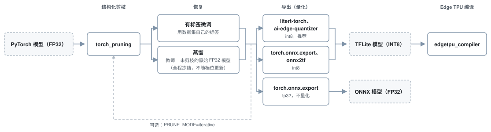

# int8-pruning-pipeline

[English](README.md) | **简体中文**

[](https://github.com/jiaheguo521/int8-pruning-pipeline/actions/workflows/checks.yml)
[](LICENSE)
[](pyproject.toml)
[](https://huggingface.co/jiaheguo521/int8-pruning-pipeline-models)

本仓库是一条 PyTorch 端侧部署流水线：从一个 FP32 模型出发，经结构化剪枝、精度恢复、
导出，产出 INT8 TFLite（可选再编译成 Edge TPU 产物）或 FP32 ONNX。



复用这条流水线的代价经过测量。接一个新模型进来要写的流水线侧代码分两档：模型自带数据与评测口径、模型能归进已有家族时，只需在 `family.yaml` 里多一条声明，约 21 到 30 行；需要新起一个家族时，按（仓库已有七族上）统计新增代码为 54 到 169 行，中位数 94。口径写在[换成你自己的模型](#换成你自己的模型)里。

已有七族里有一族是分类，其余是检测、分割、Re-ID 和开放词表。如果想接入的模型和上述流水线里的某个工具所要求的结构差异较大（可以查阅相关仓库的要求），可以先蒸馏成一个 CNN 学生再接入，参考 [`jiaheguo521/relu-clip`](https://github.com/jiaheguo521/relu-clip)。

结构化剪枝由[`torch_pruning`](https://github.com/VainF/Torch-Pruning) 实现。
恢复有两条路线，在数据集自己的标签上微调，或者向冻结的未剪枝原网络蒸馏。
默认的 INT 8 导出链路使用 `litert-torch` 和 `ai-edge-quantizer`，也可选 `torch.onnx.export` → `onnx2tf`。第三条导出链路不量化，导出一个 fp32 ONNX 图。

计量单位是**档位（rung）**：把一个模型剪到一个目标参数削减率，再恢复，算一档。
这里有 **121** 档，横跨 **7** 个家族，另有 **154** 张 int8 图被逐字节审计过。
网格里没跑过的格子，[`criterion_census.json`](results/criterion_census.json) 会记下
「没跑过」，而不是让网格看起来是填满的。再往下到可选的 Edge TPU 后端：已有 **89** 个模型
在 Coral USB Accelerator 上实测过延迟，按编译产物算共 **131** 件。同一个网络走两条导出
路径算两件产物，同一件产物重测一次仍算一件；三个合成的 I/O 对照件计入产物数、不计入
模型数。计数出处：[`criterion_census.json`](results/criterion_census.json)、
[`tflite_size_audit.json`](results/tflite_size_audit.json)、
[`full_scope_grid.json`](results/detection/full_scope_grid.json)、
[`edgetpu_census.json`](results/edgetpu_census.json)。


*核心结论。六个模型跨三个家族，**各自削掉的参数比例都是约 90%**，回报却差了 12 倍。
原因是**在这台设备上**，剪枝真正买到的是「不再从主机搬权重」：起点就装得进 Edge TPU 那 8 MiB 参数
缓存的，本来就没有这笔开销，只**快 1.26 倍**；起点超出缓存 3.4 倍的，把 21.6 MiB 的搬运
剪没了，**快 15.03 倍**。右图上的圈标出每个模型片外归零的那一档（20%、40%、80%、80%），
曲线在那一档转折。六个模型剪完之后片外字节全是 0：**在这块加速器上，剪枝真正买到的是这个，
不是「参数变少」。**
见下面的[主要发现 2](#主要发现)。*

## 这是什么

按上面那张图的阶段顺序展开。

算力都花在恢复上。剪枝本身是 data-free 的：这里五种重要性准则全都只从权重算，
`pruner.step()` 之前不需要任何前向，整条阶梯的开销都在它后面那一步。有标签可用时
worker 就在标签上微调；没有可用标签时（`clip_rn50`、`reid`、`relu_clip`）它向一个在
**剪枝之前**取的冻结 `copy.deepcopy` 蒸馏，也就是说教师是未剪枝的原网络本身，
不是另一个更大的模型。七族里有三族走这条路，而且这三族一个标注都不需要：两个 CLIP
塔在无标注 ImageNet 上蒸馏，Re-ID 在无标注的 Market-1501 裁剪图上蒸馏。它买到的是
「不需要标注」，**不是省算力**。教师那一次前向让蒸馏步比有标签步贵 **1.31 倍**
（稠密模型）到 **2.63 倍**（剪到 90%），因为学生变小时教师不会跟着变小
（[`distill_vs_labelled_cost.json`](results/protocol_audit/distill_vs_labelled_cost.json)）。哪一族走哪条是这个家族的性质，不是一个开关。每个家族都把这条路线、
连同自己 worker 实现了哪些剪枝模式一起声明出来，`python -m int8_pruning.manifest
capabilities` 会把这张表打出来。默认每一档都从稠密基线独立剪一次；
`PRUNE_MODE=iterative` 则走一条轨迹，把每一档恢复后的模型回流进下一轮剪枝。
[`results/`](results/) 下**没有任何一条阶梯是用它跑出来的**，而且这一条是数出来的、
不是断言的：**121 档里 0 档**，依据是每个 worker 写在档位上的模式标签
（[`criterion_census.json`](results/criterion_census.json)）。机制已验证，
它对保留精度的影响本仓没有测量。对没实现它的家族要这个模式，运行会直接停下并说明，
而不是悄悄退回默认值。

量化默认是 per-channel 的。从恢复后的模型出发有三条导出路径，其中两条到 int8。
`litert-torch` → `ai-edge-quantizer` 是默认、也是推荐的那条：它先在检测上确立
（把整张图搬上了加速器），随后推广到全部家族。`torch.onnx.export` → `onnx2tf`
可用 `EXPORT_PATH=onnx2tf` 选中，
但要在它自己的 `onnx2tf-env` 里跑。EfficientDet 在 onnx2tf 路径只有 90/479 个算子能映射到 Edge TPU，
而走 litert-torch 可以映射全部 305/305 个算子。哪些已提交的数字来自旧路径，记在
[`docs/PRUNING_HAZARDS.md`](docs/PRUNING_HAZARDS.md) §4。
`EXPORT_PATH=onnx` 是第三条导出路径，它只导出一个 fp32 ONNX 图。

流水线的接缝在 int8 `.tflite` 上。剪枝、恢复训练、校准、量化等步骤
与设备无关。`scripts/compile_edgetpu.sh` 和 Coral 基准是
需要单独调用的驱动；编译产物缺席时 `scripts/deliver.sh`
会明说这一步被跳过，而不是报错。在库里这道接缝就是一个目录：
`src/int8_pruning/backends/edgetpu/` 装的是需要工具链或设备才能跑的代码。

在这个后端上，字节预算比参数量更要紧：`edgetpu_compiler` 把装得进 8 MiB 片上缓存的
留在片上，装不下的每次推理都从主机内存现搬，所以越过这条边界之后，剪枝削掉的是搬运
而不是算术。`line_seg_link_r34` 在最后 3.59 MiB 停止外搬的那一档，从 12.93 ms
**一档之内掉到 4.89 ms**（[`param_ladder_oncar.json`](results/line_seg/param_ladder_oncar.json)）；
这值多少、以及什么时候不再值钱，是下面的主要发现 1–4。

由于本人下游仓库的需要，本仓库实现了七个家族的剪枝流水线接入，每个家族有自己的 `family.yaml`、`prune.py` 和 `eval.py`：

| 家族 | 任务 | `pruned<P>pct` 的比例口径 |
|---|---|---|
| [`imagenet_backbones`](families/classification/imagenet_backbones/) | ImageNet / Flowers-102 top-1（*转换冒烟测试，见下*） | 全模型**参数**比 |
| [`effdet`](families/detection/effdet/) | COCO 检测（mAP） | **backbone** 参数比；`--scope full` 切全模型 |
| [`ssdlite`](families/detection/ssdlite/) | COCO 检测（mAP） | **backbone** 参数比 |
| [`clip_rn50`](families/classification/clip_rn50/README.zh-CN.md) | 开放词表零样本 | 全模型**参数**比 |
| [`relu_clip`](families/classification/relu_clip/README.zh-CN.md) | 开放词表 zero-shot（efflite4 CLIP 学生） | 全模型参数比 |
| [`reid`](families/re-identification/reid/README.zh-CN.md) | 行人 Re-ID（mAP / CMC） | 全模型**参数**比 |
| [`line_seg`](families/segmentation/line_seg/) | 车道分割（IoU） | 全模型参数比（stem 带 `_param` 后缀） |

[`relu-clip`](https://github.com/jiaheguo521/relu-clip)是 tf_efficientnet_lite4 模型蒸馏 CLIP ViT-L/14 所得模型。

`effdet` 与 `ssdlite` 报的是 **backbone** 比例，其余家族报的是全模型参数比。所以按每个
worker 写进 JSON 日志的实际达成值比较，**文件名不可比**。`line_seg` 的分歧最大：它第一轮
那条阶梯是按 `torch_pruning` 真正接受的那个量（**逐层通道比**）编号的，
而参数量大致按通道比的平方下降，所以
`pruned60pct` 实际削掉的是 84.1% 参数。该阶梯已于 2026-08-22 撤下，只发参数比那条，
记录见 [`results/_deleted/`](results/_deleted/)。

[`scripts/deliver.sh`](scripts/deliver.sh) 把一个族打包成 `deliverables/<名字>/`：
剪枝后的检查点、对应的 int8 `.tflite`、编译好的 `_edgetpu.tflite`、编译器逐模型的日志，
以及 `torch.load` 反序列化检查点所需的东西。下游项目不必跑流水线就能直接用。模型二进制
不入 git，它们发布在 HuggingFace 上，用
[`scripts/fetch_deliverables.sh`](scripts/fetch_deliverables.sh) 取，每个文件都对着
[`results/deliverables.sha256`](results/deliverables.sha256) 校验。

**对外发布两个包：`effdet_lite1_pruning` 与 `effdet_lite2_pruning`**，即 EfficientDet-Lite1
@384 与 Lite2 @448 各自完整的 19 档阶梯，合计 202 件、763 MB。两者入选的理由相同：基线模型
与数据集都公开，且只走一条导出路径、没有退役路径的残留产物。`deliver.sh` 还能打的另外几个包
是下游交接件，剪枝所依据的是自建数据集，所以只留在本地；发布清单写在
[`scripts/manifest_deliverables.sh`](scripts/manifest_deliverables.sh) 里。

这里发布的每个数字都测自 [`results/`](results/) 下的一个文件；这些文件已入 git，不需要任何下载。

## 与 DSD 2026 协议的关系

本仓的评测框架来自下面这篇论文：

> M. Zouhdi, J. Guo, R. Hammadi, B. Sun, P. Leleux, T. Kłoda, M. Caccamo.
> *Pruning of Deep Neural Networks for Real-Time Execution on Edge TPU.*
> 29th Euromicro Conference on Digital System Design (DSD), Kraków, Poland, 2026.

本仓实现的流水线是在完成论文的工作时所实现的流水线的扩展实现。
结构化剪枝方法使用了 DepGraph（Fang 等，CVPR 2023）
及其参考实现 [`torch_pruning`](https://github.com/VainF/Torch-Pruning)，每个准则也各有
出处，见 [`ACKNOWLEDGEMENTS.md`](ACKNOWLEDGEMENTS.md#references)。

上述论文的实验建立在 **CIFAR-100 分类**上，所以分类是本仓
**不**重做的一条轴。本仓的 `imagenet_backbones` 家族只用来跑通导出工具链：五个 ImageNet
backbone 留作冒烟测试，没有剪枝阶梯、没有交付物，也不提出任何精度主张。力气花在
检测、分割、行人 Re-ID 和开放词表分类上。

其余各轴本仓都开了分支：

| 轴 | 论文 | 本仓 |
|---|---|---|
| 任务 | CIFAR-100，七个 CNN 架构 | 七族：检测 ×2、分割、Re-ID、开放词表 ×2 |
| 准则 | 七个 | 其中四个，外加集合外的 `lamp`；`bn_scale`、`taylor`、`obdc` 未覆盖 |
| 恢复 | 单次 100 epoch 有标签微调 | 两条：有标签微调，或向冻结的未剪枝原网络蒸馏（七族里三族无标注） |
| 导出 | ONNX → onnx2tf → ai-edge-quantizer | 三条；默认换成 litert-torch，检测上 305/305 对 90/479 |
| 延迟 | 30 warmup + 200 次，CPU 与 TPU 各一次 | 15 warmup + 100 次，只有 TPU |

## 主要发现

发现 1–4 是对一块 Coral USB Accelerator 的测量，是那台设备的性质。发现 5–7 讲的是
剪枝与量化本身；产出和复核它们都不经过加速器。

**1. 延迟正比于搬运的字节数，是斜坡不是阶跃。** 在 30 个已编译模型上拟合，
跨三个 backbone、权重 0.08–27 MiB，每个在 Coral USB 上 100 次 invoke：

```
lat_ms = 2.256 · offchip_MiB + 0.915 · onchip_MiB + 0.852          R² = 0.9963
```

一个片外字节的单价是片内字节的 **2.47×**。加入「越过边界」指示变量得到 −0.243 ms，
F(1,26) = 0.10，不显著，而且符号与"悬崖"相反。

**片外字节的单价可以移植到另一个家族，定律的其余部分不能。** 在六个 Re-ID 档位上重拟合
（不同 backbone、不同任务、同一台设备）得到
`2.294 · offchip + 0.256 · onchip + 2.887`，R² = 0.9979。片外系数落在车道分割那组
2.256 的 **1.7%** 以内；片内系数（0.256 对 0.915）和截距（2.887 对 0.852）则完全对不上。
这正是应该发生的：后两项吸收的是各家族自己的计算量，而片外那一项是传输速率。
→ [`results/line_seg/param_ladder_oncar.json`](results/line_seg/param_ladder_oncar.json)、
[`results/reid/coral_latency.json`](results/reid/coral_latency.json)，
两组都由 [`results/latency_law/fit_latency_law.py`](results/latency_law/fit_latency_law.py) 重算。


*左：扣掉片内项之后拟合就是一条直线，18 个不流式传输的模型落在同一条线上、没有断口。右：同一批数字画成加速比，拐点来自倒数变换。*

**2. 剪枝的回报由起点决定，不由比例决定。** 六个模型、三个家族、同一台设备、同一个准则
（`magnitude_l2`，EfficientDet 只有 `lamp` 能撑到最深档），各自削掉自身约 90% 的参数。
体积那一列用的是编译器自己报的权重预算，8 MiB 缓存衡量的正是这个量：

| 模型 | 家族 | 稠密权重 | 延迟 | 加速比 |
|---|---|---:|---|---:|
| `line_seg_base128` | line_seg | 0.32 MiB（远低于） | 0.807 → 0.640 ms | **1.26×** |
| `efficientdet_lite1` | effdet | 6.29 MiB（低于，不流式） | 52.404 → 40.796 ms | **1.28×** |
| `efficientdet_lite2` | effdet | 7.83 MiB（低于，却仍溢出 0.69） | 78.538 → 58.707 ms | **1.34×** |
| `line_seg_w96` | line_seg | 8.32 MiB（压在容量上） | 12.698 → 2.281 ms | **5.57×** |
| `reid_youtu_lite` | reid | 25.69 MiB（3.2 倍于容量） | 46.894 → 3.253 ms | **14.42×** |
| `line_seg_link_r34` | line_seg | 27.29 MiB（3.4 倍于容量） | 55.677 → 3.704 ms | **15.03×** |

两个**一个字节都不流式传输**的模型体积差 20 倍，加速比却落在 1.26× 和 1.28×：没有字节要搬，
剪枝就只能削掉算术运算，剩下的是这一族自己的固定开销（见发现 3）。`efficientdet_lite2`
正落在边界上：它起点 7.83 MiB，**在 8 MiB 缓存以内**却仍然溢出 0.69 MiB（缓存装的
不只是参数），把这一点点搬运剪掉换来 1.34×。两个起点**约为容量 3.3 倍**的模型落在
14.42× 和 15.03×，而它们分属互不相干的两个架构（一个 Re-ID 的 ResNet-50、一个分割的
ResNet-34）。能预测回报的是**离缓存有多远**，不是家族、不是比例，也不是体积落在容量的哪一侧。
→ [`results/line_seg/param_ladder_oncar.json`](results/line_seg/param_ladder_oncar.json)、
[`results/reid/coral_latency.json`](results/reid/coral_latency.json)、
[`results/detection/full_mapping_ladder_lite1.json`](results/detection/full_mapping_ladder_lite1.json)

*（顶部那张图画的就是这件事：左边是每个模型的最深档位对它的起点，对数轴，虚线是缓存
容量；右边是同样这六条完整的档位曲线，并在每条曲线片外归零的那一档画了一个圈。一个字节
都不流式传输的那两个一路平到 −90%，另外四个都在各自那个圈处转折。每个圈的位置都读自
该模型自己的编译结果，不是从体积推出来的。）*

**3. 检测这一族整张网络都跑在加速器上，剩下的是一条固定 I/O 地板。** EfficientDet-Lite1 在剪枝
之前就已全部片上（8 MiB 缓存里占 6.29 MiB），19 个档位一个字节都不流式传输，所以
发现 1 的机理在这里没有作用对象。它过去还有 **479 个算子里 389 个回落到 CPU**，
这一条后来查明是**导出工具造成的，不是架构**。改走 litert-torch + ai-edge-quantizer，
配合两处数值等价的模型侧改写之后，**305 个算子全部映射到 TPU，CPU 上一个不剩，每一档
都是如此**（479 → 305 是同一个网络算子数变了，新导出器发出的算子更少更大，不是剪枝的结果）。真正卡住它的是一条
固定 I/O 地板：**未剪枝的 52.404 ms 里有 34.95 ms**，来自每次 invoke 进 0.42 MiB、出
2.48 MiB；头在每一档都出 810 通道，剪不掉。最深的那一档（削掉 88.6% 参数，再往下
`torch_pruning` 的逐层限制就不让走了）只快 1.28 倍。

**全映射消除了主机 CPU 这一未受控变量。** CPU 上一个算子都没有，测出来的延迟就只反映
加速器和模型。本仓**更早**那批检测延迟，是在
479 个算子里 389 个跑在一台**连记录都没有**的主机 CPU 上测的
（[`coral_latency.json`](results/detection/coral_latency.json) 的 `host_note`），
拿它们比较各个档位，比的是台架条件和模型的混合。现在这 19 个档位彼此可比，也和别人手上的
Coral 可比，因为测量里没有别的东西。把 810 通道的头留在 CPU 上**确实**在桌面级处理器上
更快（回传 0.26 MiB 而不是 2.48 MiB），但切分点该落在哪里是**主机的**性质、不是模型的，
该由跑它的那套系统用自己的基准回答。
→ [`results/detection/full_mapping_ladder_lite1.json`](results/detection/full_mapping_ladder_lite1.json)
（更早那份部分映射的构建，以及 SSDLite 那几行，在
[`results/detection/coral_latency.json`](results/detection/coral_latency.json)）

**地板随输出张量放大，这一条由第二个模型量到。** 448 px 的 EfficientDet-Lite2，19 档，
340/340 算子全映射，拟合出 `46.43 + 9.750 · MMACs/1000`。那个截距并不是拿 I/O 账凑出来的：
把 Lite2 每次推理过 USB 的 3.95 MiB，按在 **Lite1 衍生的**对照件上量到的 **86.8 MiB/s**
直接算，不重新拟合、不引入新常数，得到 **45.48 ms，占地板的 98%**。流量涨 1.36 倍，
地板涨 1.33 倍。
→ [`results/detection/full_mapping_ladder_lite2.json`](results/detection/full_mapping_ladder_lite2.json)


*左：两个检测模型各自的 19 档，分开拟合，绝不合并。Lite1 坐在 34.95 ms 的地板上，
Lite2 坐在 46.43 ms 的地板上，分别占各自 dense 推理的 67% 和 59%，剪枝哪一层都够不着。
右：把通道数向上补齐到宽度 W 再算 MAC，拟合在 **W = 64** 处最好，那正是加速器脉动阵列的
宽度；低于它，把一层削得更窄和削到 64 花的时间一样。**两个模型的峰值都在 64**，这正是
它成为一条关于加速器、而不是关于某一个网络的论断的原因。*

**4. 地板之上，决定延迟的是「通道数补齐到加速器 64 宽 tile」之后重算的 MAC，不是
原始 MAC。** 对着原始 MAC，Lite2 的混合拟合 R² 有 0.9503，仍然藏着它自己的结构：
9 档 `lamp` 全部落在拟合线上方，9 档 `magnitude_l2` 里有 7 档落在下方。
两支分开拟合，R² 分别到 **0.9917** 和 **0.9703**，斜率差 2.0 µs/MMAC；**把 MAC 配平之后
`magnitude_l2` 最多快 5.48 ms**，而在 7 对配平里有 6 对是它带着*更多*的片上权重，
两支片外都是 0 B。所以这不是权重搬运。

**两条轴之间唯一变的就是补齐，而它把差距压掉 22 倍。** 给这条阶梯做一次通道普查之后，
就可以把延迟拟合到「通道数向上补齐到上面右图定出的 W = 64」重算的 MAC 上。这一改把
两支的斜率差从 **1.964 压到 0.088 µs/MMAC**，同时把混合拟合的 R² 从 0.9518 抬到 0.9829。
两支并不是在服从两条不同的定律：它们留下的通道数不同，而原始 MAC 那根轴看不见补齐量。
在原始轴上配平到 5% 以内的档位对，补齐之后最多差 12.3%。Lite1 同向、更弱
（2.3889 → 0.3909）。**没有消失的是一个水平偏移**：两支平均残差仍差 1.14 ms，这一部分没有解释。
→ [`results/detection/full_mapping_ladder_lite2.json`](results/detection/full_mapping_ladder_lite2.json)、
[`results/detection/channel_census_lite2.json`](results/detection/channel_census_lite2.json)


*两张子图都是相对混合拟合线的残差，两者之间唯一的差别就是有没有补齐：MAC 在两根轴上
都是同一套重数方式。左：每一档 `lamp` 都在线上方，`magnitude_l2` 除两档外都在下方。
右：两支合拢到线上，剩下没被吸收掉的 1.14 ms 偏移，就是仍未解释的那一部分。*

**5. 换一个重要性准则，在约 60% 削减处把保留的 mAP 从 44.1% 抬到 86.0%。**
同样的架构、同样的目标、同样在 COCO train2017 上恢复 40 个 epoch，`lamp` 对
`magnitude_l2`（后者是 DSD 2026 协议点名的那个）。保留率是相对未剪枝 fp32 mAP 而言；
`lamp` 削 50% 仍然打得过 `magnitude_l2` 削 10%。这个差距不是量化造成的：恢复训练之后
在 fp32 阶段就已经存在。论文那句「精度随压缩只有小幅下降，明显的差距只出现在最高
剪枝率」，在迁到检测、且用它自己那个被测过的准则时未能复现：约 60% 削减处已经只剩
44.1%，而那并不是最高档。**这一条在第二个模型上复现了**：同一套网格在 448 px 的
EfficientDet-Lite2 上跑满九档，同一削减处落在 44.2% 与 84.8%；`lamp` 那一支从 10% 到 70%
每一档的保留 mAP 两个模型相差都在 2.1 个百分点以内（`magnitude_l2` 那一支松一些，阶梯
中段最多差 6.5 个百分点，但两个模型上都远低于 `lamp`）。那是跨尺度、跨输入分辨率的复现，
不是跨架构族的。两个模型现在每一列都齐了。同一套 int8 harness（重跑 Lite1 dense 复现出
0.31748，分毫不差），Lite2 dense 的量化代价是 **−1.65%**，对 Lite1 的 −1.38%：相当，而不是
早先那个错误导出所暗示的 4 倍差距。上机延迟方面，它的 dense 档是 **78.538 ms**，对 Lite1 的
52.404，两者相差的 26.1 ms 里有 11.5 ms 是更高的固定 I/O 底噪，剪枝够不着。
在高剪枝率上支撑 CIFAR-100 结果的那三个准则在这里未测（见发现 7），所以这只是准则空间
里的一个点，不是对它的刻画。
→ [`results/detection/full_mapping_ladder_lite1.json`](results/detection/full_mapping_ladder_lite1.json)、
[`results/detection/full_mapping_ladder_lite2.json`](results/detection/full_mapping_ladder_lite2.json)、
[`results/detection/full_scope_grid.json`](results/detection/full_scope_grid.json)（Lite2 那一半）


*每个模型一张子图，各自对自己未剪枝的 fp32 mAP 画百分比，因为两个基线不同（0.3219 与
0.3588），画绝对 mAP 会把它们的共同之处盖掉。准则差距复现了：同一个约 60% 的削减处，
Lite1 是 86.0% 对 44.1%，Lite2 是 84.8% 对 44.2%。虚线是真正跑在设备上的 int8 产物；
它与 fp32 的差距随剪枝比例拉大，`magnitude_l2` 比 `lamp` 拉得更快。*

**6. 把通道放到全网一起排序、而不是在每层内部排序，会摧毁任务指标，而所有汇总统计量
看起来都正常。**
全局排序配 `torch_pruning` 默认的 mean-归一化幅值，会把削减几乎全部集中到网络
最窄的早期层：EfficientDet-Lite1 mAP 0.322 → **0.0003**，CLIP RN50 零样本
99.0% → **0.0%**，而后者只削了 −30.2% 参数。触发因素是层的**宽度**，不是块的类型：
一个普通 ResNet 和倒残差 backbone 一样会垮。
→ [`results/detection/pruning_matrix.json`](results/detection/pruning_matrix.json)、
[`results/clip_rn50/global_allocation.json`](results/clip_rn50/global_allocation.json)


*成因：`normalizer='mean'` 之后每组的均值恰好都是 1.0，跨层尺度已经被抵消。差别在每组内部的左尾，而它几乎全长在早期的 depthwise 组上。*

**7. 准则覆盖很不均匀，其中两个缺口是结构性的、不是预算问题。**
实现了五个准则；`magnitude_l2` 有 101 个档，`lamp` 有 20 个，其余三个一个都没有。
协议那七个里，`obdc` 和 `bn_scale` 在本仓的检测 bench 上**不可评估**：
`obdc` 需要 `DetBenchTrain` 不暴露的类别后验，`bn_scale` 需要另一条 100 轮的稀疏
预训练流程。两者在它们被确立的任务上都定义良好，只是这里拿不出它们要的东西；缺口来自
**协议对任务的要求**，不是预算。
→ [`results/criterion_census.json`](results/criterion_census.json)、
[`results/detection/full_scope_grid.json`](results/detection/full_scope_grid.json)、
[`docs/PRUNING_HAZARDS.md` §3](docs/PRUNING_HAZARDS.md)（含 `lamp` 不在协议那七个之内）

> **在信任本仓任何一条扫描结果之前，先读
> [`docs/PRUNING_HAZARDS.md`](docs/PRUNING_HAZARDS.md)。** 那是方法论文档：
> 每个数字靠什么支撑、哪几条主张比其余的弱，以及 `pruned<P>pct` 在各族的含义。

## 换成你自己的模型

`pruner.step()` 之后的那半程并不专属于已经走过它的这七个模型。一个家族拥有的是模型、它的数据和它的指标；
流水线拥有的是 `pruner.step()` 之后的全部。

本仓库是一条流水线而不是某一个项目的脚本，因为已经有七个家族从它里面走过，而其中只有一个是
分类。每个家族在自己的 `family.yaml` 里声明自己实现了什么；
`python -m int8_pruning.manifest capabilities` 会把这张表打出来，而 `scripts/pruning.sh`
在一次运行向某个家族要它从未声明过的东西时会**直接拒绝**，而不是悄悄退回默认值：

<!-- generated: capabilities -->
```
family              recovery  prune modes              int8   deliver  edgetpu
----------------------------------------------------------------------------------
clip_rn50           distill   independent iterative    1 cfg  --       --
effdet              labelled  independent              2 cfg  yes      yes
imagenet_backbones  labelled  independent iterative    6 cfg  --       --
line_seg            labelled  independent              3 cfg  yes      yes
reid                distill   independent              6 cfg  yes      yes
relu_clip           distill   independent iterative    1 cfg  --       --
ssdlite             labelled  independent              1 cfg  --       --
```
<!-- /generated -->

新接入一个模型家族要花多少代价，前七个接入家族已经量过了。口径固定为三项，全部按非空非注释行计：
一份 [`family.yaml`](families/classification/relu_clip/family.yaml) 声明、worker 里调用
`int8_pruning.*` 的行、以及 [`src/`](src/int8_pruning) 与 [`scripts/`](scripts) 里
点名该家族的行。以 [`relu_clip`](families/classification/relu_clip) 为例：

| 流水线要求你写的 | 行数 |
|---|---:|
| `family.yaml`，那份声明 | 26 |
| worker 里调用 `int8_pruning.*` 的地方 | 25 |
| `src/` 与 `scripts/` 里为它留下的 | 10 |
| **适配代码合计** | **61** |

七族同口径数下来是 **54 到 169 行，中位数 94**：`clip_rn50` 54、`ssdlite` 55、
`relu_clip` 61、`effdet` 94、`line_seg` 100、`imagenet_backbones` 162、`reid` 169。
贵的两族贵在不同的地方：`imagenet_backbones` 的 `family.yaml` 一份声明了六个基线，
`reid` 则在共享代码里留下 43 行特判，是七族里数据与评测离其他家族最远的一个。
结构是否特殊并不决定成本，`clip_rn50` 反而是最便宜的一个。

上面数的是**新起一个家族**。模型能归进已有家族时便宜得多：`imagenet_backbones` 的 worker
对它的五个骨干是通用的，`prune.py` 里只有 docstring 提到型号名，再加一个 torchvision
分类骨干只要 `family.yaml` 里的一条声明。按三个多模型家族折算，每个模型 21 到 30 行
（`imagenet_backbones` 106 行 / 5 个模型，`line_seg` 72 / 3，`effdet` 60 / 2）。唯一一次单独
提交的同族新模型是 `efficientdet_lite2`，它多花了 27 行 worker 代码，因为输入尺寸和
anchor 配置与 lite1 不同。

这三项之外的代码不算适配。`relu_clip` 的 worker 有 460 行非注释代码，除去上面那 25
行调用，其余是它自己的蒸馏恢复与评测；`student.py` 的 92 行是学生网络的定义。这些
有没有流水线都要写。流水线换给你的是 [`src/`](src/int8_pruning) 和 [`scripts/`](scripts)
下那约 4000 行，以及**一次声明贯穿三个阶段**：同一个文件同时指定剪枝 worker、
int8 转换配置（七族共 20 个）和交付契约。

这些分支是留开的，不是预先定死的。恢复可以走有标签、也可以走蒸馏，蒸馏本身有两种损失：
余弦，以及学生嵌入维度和教师不再一致时用的、与维度无关的相似度矩阵损失。分配可以全局、
也可以逐层。阶梯可以是各档独立，也可以是一条热启动的轨迹。五种重要性准则。两条导出路径，
默认都是 per-channel，旧那条还可以选 per-tensor。**一个家族「能跑什么」和「实际跑过什么」
是两个问题**，[`criterion_census.json`](results/criterion_census.json) 回答的是第二个：
这里没有任何地方用「支持」来冒充「测过」。

## 复现

环境、数据集与三个流水线阶段：**[`docs/SETUP.zh-CN.md`](docs/SETUP.zh-CN.md)**。

`./scripts/check.sh` 会把下面这些里当前环境跑得动的全部跑一遍，
`./scripts/check.sh --clean-clone` 只跑 CI 跑的那一档。要单条运行的话：

上面那些测量主张不需要跑流水线。从一个 clone 出发，除标准库外无任何依赖：

```bash
# 发现 1：重拟合延迟定律与阶跃检验，并断言文中发布的数值
python3 results/latency_law/fit_latency_law.py --check

# 剪枝阶梯的几条契约：档位命名、续跑点、严格升序。这几条里任意一条破掉，
# 跑出来的都是一次「顺利结束并报出数字」的运行。
python3 -m unittest discover -s tests

# 文档结构：链接、图片、中英对齐、README 里每个数字是否在 results/ 下存在，
# 以及 scripts/ 下每个驱动是否在文档里有出处
./scripts/check_docs.sh
```

在完整工作树、且有 `torch` 的机器上：

```bash
# 发现 6：崩溃背后的分配统计（CPU，约 1 分钟，无前向）
python3 results/protocol_audit/allocation_stats.py

# 发现 7：在所有 worker 日志上重数一遍准则
python3 results/protocol_audit/criterion_census.py
```

方法论文档 §1 与 §3 背后的那些运行（脚本、summary 与 stdout）都在
[`results/protocol_audit/`](results/protocol_audit/)。

## 仓库结构

```
src/int8_pruning/   各家族共用、可 import 的库（唯一被打包的代码）
  backends/edgetpu/ 可选后端：跑起来需要 edgetpu_compiler 或一块 Coral 的代码。
                    包内其余部分都不 import 它。
families/<task>/<name>/
                    每族自己的 family.yaml + prune.py + eval.py，它们**产出**模型
scripts/            流水线本体：下载、剪枝、转换；然后可选地编译、基准、交付；
                    外加建虚拟环境的 setup_env.sh，和复算全部已发布数字的 check.sh
results/            本仓发布的全部测量，以及产出它们的代码
tests/              src/ 里那些「破了也不报错」的契约的单元测试；只用标准库
docs/               SETUP、PRUNING_HAZARDS（方法论）、模型卡、co-compile 说明
```

三个代码目录职责不重叠：`src/` 是被 import 的，`families/` 与 `scripts/` 是被执行的
流水线阶段，而 `results/` 下的 `.py` 是一次性分析脚本、与它们产出的数字放在一起。
`tests/` 只 import `src/`，别的什么都不碰，所以它跑在 CI 跑的那一档里。
该目录自身的结构见 [`results/README.md`](results/README.md)。

`outputs/`（流水线产物）与 `deliverables/`（下游交付）是生成物，不入 git。

## 引用方式

引用本仓库，见 [`CITATION.cff`](CITATION.cff)：

```bibtex
@software{guo2026int8pruning,
  author  = {Guo, Jiahe and Zouhdi, Mouad and K{\l}oda, Tomasz},
  title   = {int8-pruning-pipeline: structured pruning, int8 quantization and
             Edge TPU compilation across model families},
  year    = {2026},
  license = {Apache-2.0},
  url     = {https://github.com/jiaheguo521/int8-pruning-pipeline}
}
```

引用本仓所沿用的评测协议出处（那项 CIFAR-100 研究）：

```bibtex
@inproceedings{zouhdi2026pruning,
  author    = {Zouhdi, Mouad and Guo, Jiahe and Hammadi, Rafik and Sun, Binqi
               and Leleux, Philippe and K{\l}oda, Tomasz and Caccamo, Marco},
  title     = {Pruning of Deep Neural Networks for Real-Time Execution on Edge {TPU}},
  booktitle = {29th Euromicro Conference on Digital System Design (DSD)},
  address   = {Krak\'ow, Poland},
  year      = {2026}
}
```

本仓各族实际使用的结构化剪枝方法：

```bibtex
@inproceedings{fang2023depgraph,
  author    = {Fang, Gongfan and Ma, Xinyin and Song, Mingli
               and Mi, Michael Bi and Wang, Xinchao},
  title     = {DepGraph: Towards Any Structural Pruning},
  booktitle = {IEEE/CVF Conference on Computer Vision and Pattern Recognition (CVPR)},
  year      = {2023}
}
```

逐准则的出处，以及模型、数据集与 Edge TPU 相关文献，见
[`ACKNOWLEDGEMENTS.md`](ACKNOWLEDGEMENTS.md#references)。

## 许可与致谢

Apache-2.0，见 [`LICENSE`](LICENSE)。发布出去的模型权重仍受其上游来源各自的条款约束。

本工作在 **LAAS-CNRS**（法国图卢兹）完成，计算在 LAAS-CNRS 的算力设施上完成，
由 **Tomasz Kłoda** 指导。本仓所循的研究方向由他推荐，他也是本仓沿用其评测协议的
DSD 2026 那篇论文的共同作者。实习期间，他给了我很大的研究自由，同时在需要时随时提供指导。

本流水线构建在这些工作之上：`torch_pruning`、
`litert-torch` 与 `ai-edge-quantizer`（google-ai-edge）、`timm`、
`efficientdet-pytorch`、`open_clip`、`deep-person-reid` 与 `google-coral`。
完整致谢见 [`ACKNOWLEDGEMENTS.md`](ACKNOWLEDGEMENTS.md)。
